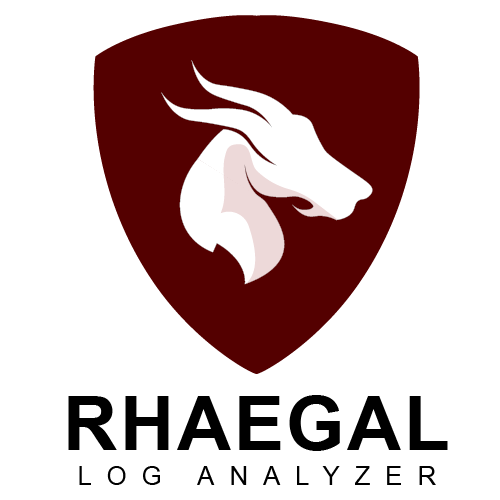

<p align="center">
  
</p>

# What is Rhaegal ?

Rhaegal is a tool written in Python 3  used to scan Windows Event Logs for suspicious logs. Rhaegal uses custom rule format to detect suspicious/malicious logs, the rules schema will be discussed in details later on. This project contains two main script the first is `RhaegalLib.py` which is the main script that handles Windows Event Logs parsing and rules parsing and validation. The second script is `Rhaegal.py` which is a script that takes the user options and uses `RhaegalLib.py` script to search through Windows Event Logs with the specified ruleset.

# How to install Rhaegal ?

 There is two ways to install Rhaegal:

1. Download the zip file or clone this repository using the following command:

   `git clone https://github.com/AbdulRhmanAlfaifi/Rhaegal.git`

   Then execute the following command to download the dependences :

   `pip install -r requirments.txt`

2. Simple download the ZIP file from the release section. The file contains:
   * The compiled version of `Rhaegal`.
   * A folder that contains Rhaegal rules.

# How to use it ?

You can use Rhaegal in two ways:

1. Using Rhaegal library (*Check the wiki to learn more*)
2. Using Rhaegal to scan Windows Event Logs.

The following section describe how to use the tool and the various option to use.

After the installation of Rhaegal navigate to it's directory then execute `rhaegal -h` or `python3 rhaegal.py -h` (depending on how you download it) to show a help massage describing how to use the tool. The following is what you will see:

```
usage: rhaegal.py [-h] [-l LOG] [-lp LOGSPATH] [-r RULE] [-rp RULESPATH]
                  [--headers] [-o OUTPUT] [-n THREADS] [--no-log]
                  [--log-file LOG_FILE]
                  [--log-level {CRITICAL,ERROR,WARNING,INFO,DEBUG}] [-v]

Rhaegal, Windows Event Logs Processing and Detection Tool

optional arguments:
  -h, --help            show this help message and exit
  -l LOG, --log LOG     The log you want to run the rules against
  -lp LOGSPATH, --logsPath LOGSPATH
                        A path that contains Windows Event Logs files (EVTX)
                        to run the rules against
  -r RULE, --rule RULE  Rhaegal rule you want to use
  -rp RULESPATH, --rulesPath RULESPATH
                        Path that contains Rhaegal rules
  --headers             Print the headers
  -o OUTPUT, --output OUTPUT
                        Results output file (Defaults to stdout)
  -n THREADS, --threads THREADS
                        Number of threads to use (Default=10)
  --no-log              Do not create log file
  --log-file LOG_FILE   Log file path
  --log-level {CRITICAL,ERROR,WARNING,INFO,DEBUG}
                        Logging level (Defaults to INFO)
  -v, --version         Print version number
```

* -l <LOG> **or** --log <LOG> : A Windows Event Log file to process.
* -lp <LOGSPATH> **or** --logsPath <LOGSPATH> : A path that contains Windows Event Logs file (.evtx files) for the toll to process.
* -r **or** --rule : A Rhaegal rule file to use on the processing.
* -rp **or** --rulesPath :  A path that contains Rhaegal rule files that will be used to scan the specified logs.
* --headers : Prints CSV headers.
* -o **or** --output: The results output file (Default is **stdout**)
* -n **or** --threads: Rhaegal make use of multithreading. with this option you can specify the number of threads Rhaegal can use.
* --no-log: Do not make a log file.
* --log-file: The path for the log file to be used by Rhaegal.
* --log-level: The log level (Default is **INFO**)
* -v **or** --version: Prints RhaegalLib **&** Rhaegal version numbers.

# Examples

In the following example I ran the tool on log samples with the ruleset on this repository. The tool outputs the rules in CSV format on this format:

```
"DateAndTime","EventRecordID/s","RuleName","RuleScore","RuleDiscription","RuleRefrence","MatchedStr","Rule Return"
```

 The following is an example of the output:

**NOTE** : The image above only contains three colums but the actual output is 8 colums.

# Can I use SIGMA rules with this tool ?

Yes you can ! I wrote  a script that translates SIGMA rules to Rhaegal rules. The script could be found on this repository on `Tools/SigmaToRhaegal.py`. Here is how to use the tool:

```
usage: SigmaToRhaegal.py [-h] -r RULESDIR -o OUTPUT

Convert SIGMA rules to Rhaegal rules

optional arguments:
  -h, --help            show this help message and exit
  -r RULESDIR, --rulesDir RULESDIR
                        Path tat contains SIGMA rules.
  -o OUTPUT, --output OUTPUT
                        The path where the results will be saved.
  -v, --version         Print version number
```

* -r **or** --rulesDir : A folder that contains the SIGMA rules that you what to convert to Rhaegal rules.
* -o **or** --output : The name and/or path of the file that you what Rhaegal rules to be write to.

for example I have SIGMA rule in the folder called `rules` and I want the rules to be save to file called `sigmaRules.gh` so I will execute the following command `python3 -r rules -o sigmaRules.gh `

# More Info

For more information about this project check the wiki page.

# Contribution

Please feel free to submit and issues you find or any features you want to be added :)

# Contacts

You can reach me on Twitter on `@A__Alfaifi`.

